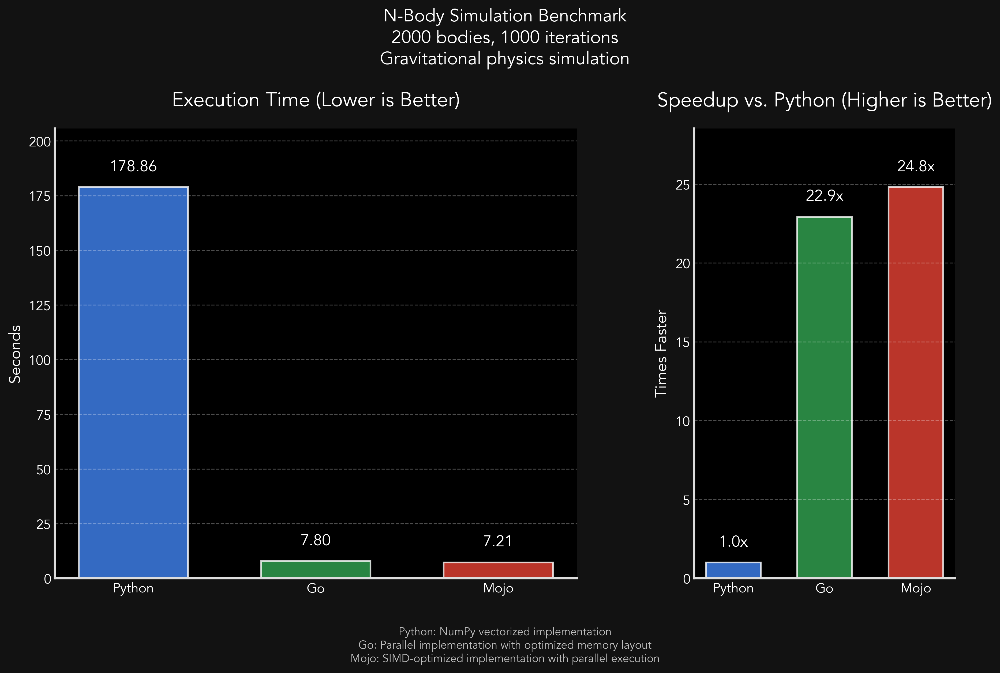

# PyGoMo: N-Body Simulation Benchmark

A comparative benchmark of N-body gravitational simulation implemented in Python, Go, and Mojo to evaluate their performance characteristics for computationally intensive floating-point operations.

## Benchmark Results



The benchmark results show significant performance differences between the three implementations:

- **Python**: ~179 seconds (baseline)
- **Go**: ~7.8 seconds (~23x faster than Python)
- **Mojo**: ~7.2 seconds (~25x faster than Python)

These results were obtained by running the simulation with 2000 bodies for 1000 iterations on the same hardware.

## Overview

This project implements the same N-body simulation algorithm in three different languages and provides a benchmarking framework to compare their performance. The simulation models gravitational interactions between celestial bodies using Newtonian physics.

### Algorithm

The simulation uses a direct N² pairwise force calculation approach based on Newton's law of universal gravitation. For each pair of bodies, the gravitational force is calculated and applied according to:

F = G *(m₁* m₂) / r²

Where:

- G is the gravitational constant (6.67430 × 10⁻¹¹)
- m₁ and m₂ are the masses of the two bodies
- r is the distance between the bodies

### Physics Implementation Details

The simulation follows these key physics principles:

#### 1. Distance Vector Calculation

For each pair of bodies (i and j), we calculate the vector from body i to body j:

```
r_vec = position_j - position_i
```

This vector points from body i toward body j and is essential for determining the direction of the gravitational force.

#### 2. Force Magnitude

The magnitude of the gravitational force is calculated using Newton's law of universal gravitation:

```
force_magnitude = G * mass_i * mass_j / (distance * distance)
```

#### 3. Force Direction

The gravitational force acts along the line connecting the two bodies. The force vector is calculated as:

```
force_vector = force_magnitude * (r_vec / |r_vec|)
```

Where `r_vec / |r_vec|` is the unit vector pointing from body i to body j.

#### 4. Position and Velocity Updates

For each time step (dt):

1. Calculate the acceleration: a = F / m
2. Update velocity: v = v + a * dt
3. Update position: p = p + v * dt

This implements a simple Euler integration method for the equations of motion.

#### 5. Optimizations

All implementations include these key optimizations:

- **Newton's Third Law**: Each pair of bodies is computed only once, with equal and opposite forces applied to both bodies
- **Energy Conservation**: The total energy (kinetic + potential) is calculated to verify simulation accuracy
- **Efficient Distance Calculations**: Using squared distances where possible to avoid unnecessary square root operations

### Implementations

1. **Python**: Uses NumPy for efficient array operations
2. **Go**: Leverages goroutines for parallel execution
3. **Mojo**: Utilizes SIMD vectorization and parallelization features

## Project Structure

```
PyGoMo/
├── python/           # Python implementation
│   └── nbody.py      # N-body simulation in Python with NumPy/Numba
├── go/               # Go implementation
│   └── nbody.go      # N-body simulation in Go with goroutines
├── mojo/             # Mojo implementation
│   └── nbody.mojo    # N-body simulation in Mojo with SIMD
├── benchmark/        # Benchmarking tools
│   ├── benchmark.py  # Script to run and compare implementations
│   └── visualize_results.py  # Script to visualize benchmark results
└── run_benchmarks.sh # Shell script to run all benchmarks
```

## Requirements

### Python

- Python 3.7+
- NumPy
- Matplotlib
- Pandas
- Numba (optional, for JIT compilation and parallelization)

### Go

- Go 1.16+

### Mojo

- Mojo SDK

## Running the Benchmarks

To run the benchmark comparison across all implementations:

```bash
cd PyGoMo
./run_benchmarks.sh
```

The benchmark will:

1. Run each implementation with the specified number of bodies and iterations
2. Measure and compare execution times
3. Save the results to a CSV file

To visualize the benchmark results:

```bash
cd PyGoMo
python benchmark/visualize_results.py
```

This will generate a professional visualization of the benchmark results, saved as both PNG and PDF files.

## Implementation Details

### Python Implementation

The Python implementation offers two acceleration methods:

1. **NumPy Vectorization**: Uses NumPy broadcasting for efficient array operations
2. **Numba JIT Compilation**: Optional acceleration with Numba's just-in-time compilation and parallelization

Key optimizations:

- Vectorized force calculations using NumPy broadcasting
- Parallel execution with Numba when available
- Optimized memory usage and array operations

### Go Implementation

The Go implementation uses goroutines to parallelize the force calculations across available CPU cores.

Key optimizations:

- Efficient parallel implementation using goroutines
- Optimized vector operations
- Cache-friendly data structures
- Mutex-free force updates for better performance

### Mojo Implementation

The Mojo implementation showcases the language's SIMD and parallelism capabilities.

Key optimizations:

- SIMD-friendly data layout
- Explicit parallelization
- Vectorized operations
- Efficient memory management

## Customizing the Simulation

Each implementation accepts command-line parameters to adjust:

- Number of bodies
- Number of iterations
- Time step (dt)
- Random seed (for reproducibility)

Example:

```bash
cd PyGoMo
python python/nbody.py --bodies 2000 --iterations 1000
```

## License

[MIT License](LICENSE)
